# Лабораторная работа №3

**Цель:** Развернуть и настроить кластер Postgres с высокой доступностью.

---

## Часть 1: Поднимаем Postgres

1) Подготавливаем файлы для нашего постгреса.

- Dockerfile
- docker-compose.yml
- postgres0.yml
- postgres1.yml

2) Деплоим:
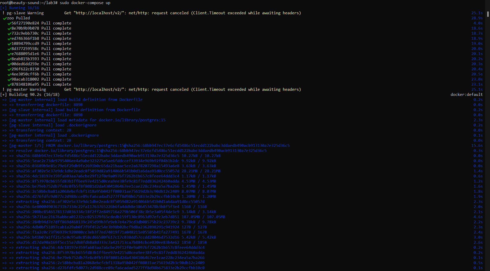

3) Проверяем в логах, что запустился zookeeper и что одна из нодов стала лидером:
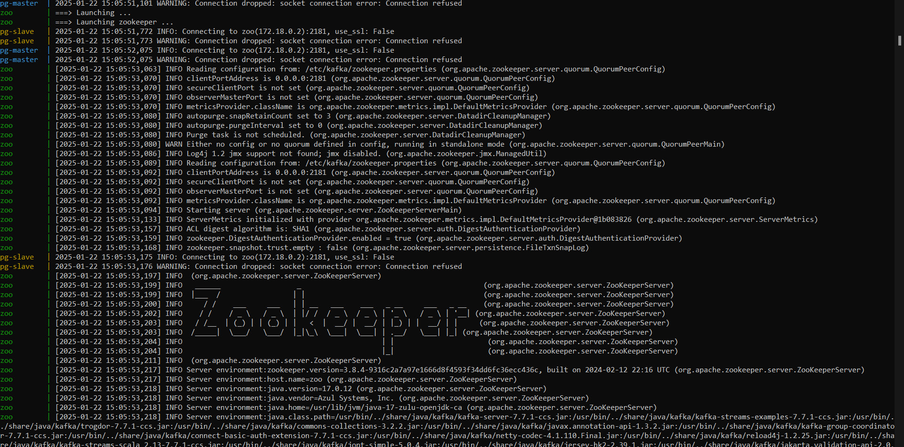
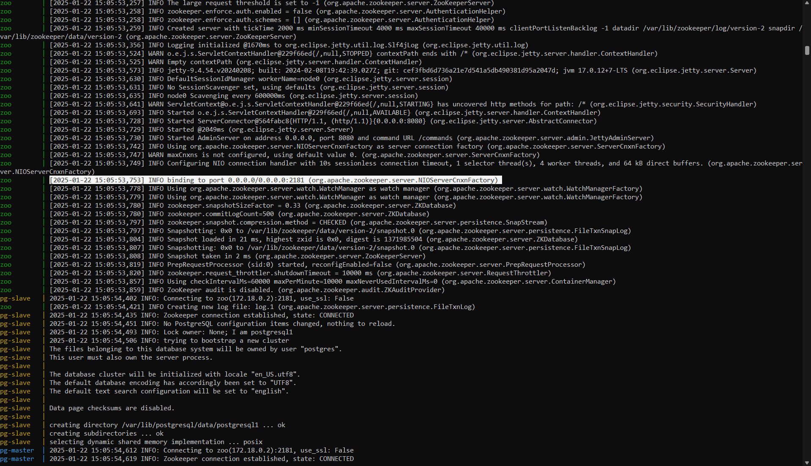
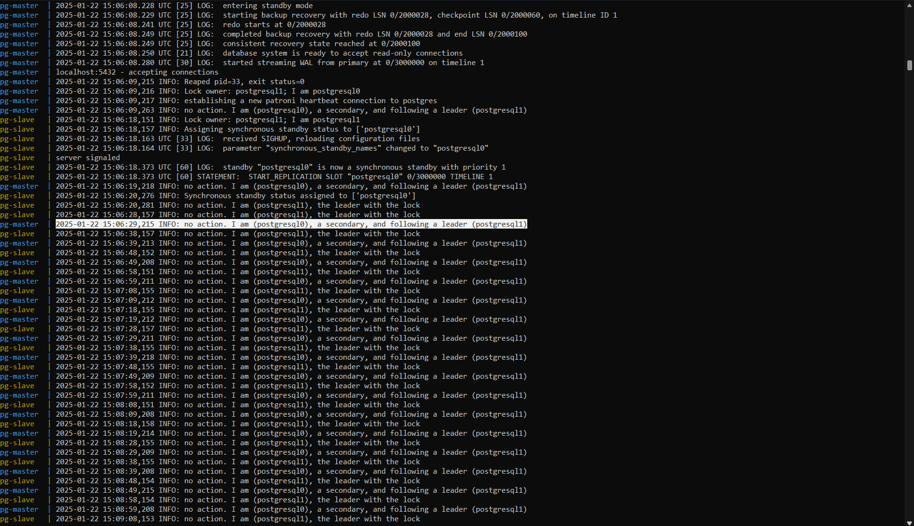

---

## Часть 2: Проверка репликации

1. Подключение к `pg-master`:

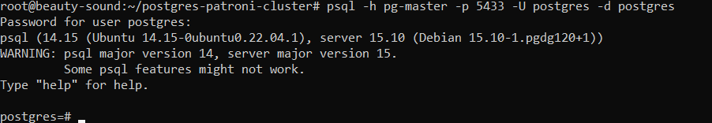

2. Создание таблицы и добавление данных.  

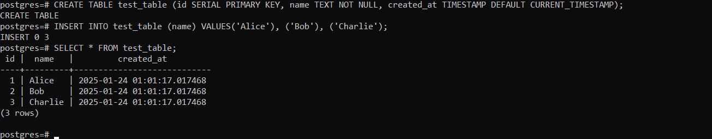

3. Подключение к реплике (`pg-slave`) и проверка синхронизации таблицы.  

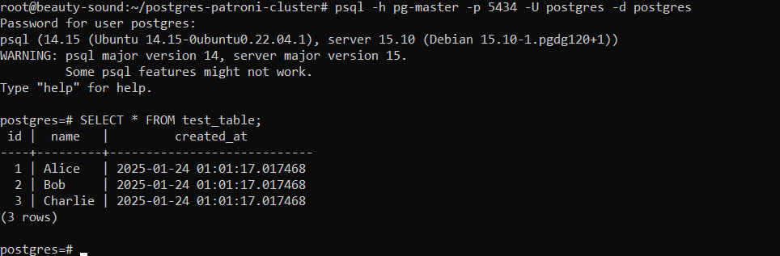

4. Проверка режима read-only: операции на реплике недоступны.
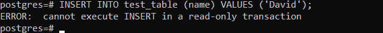

---

## Часть 3: Настройка высокой доступности

1. Добавление HAProxy в `docker-compose.yml`. Настроиваем файл `haproxy.cfg`. Перезапуск проекта и проверка логов:
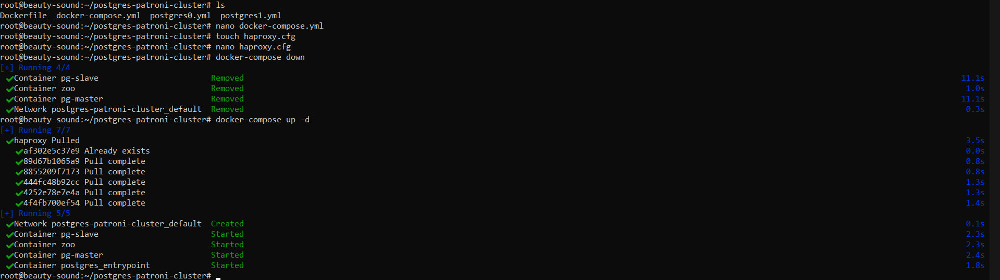

Логи zoo, pg-master, pg-slave, haproxy:
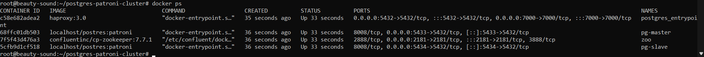
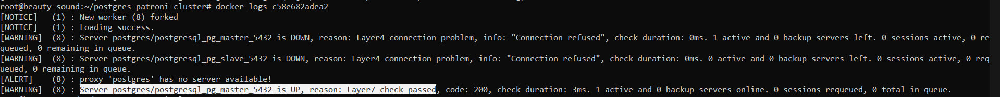
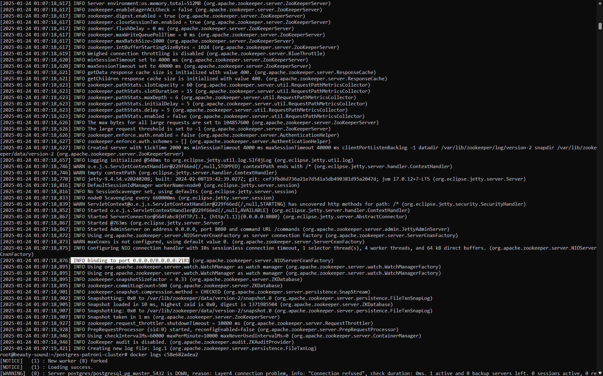
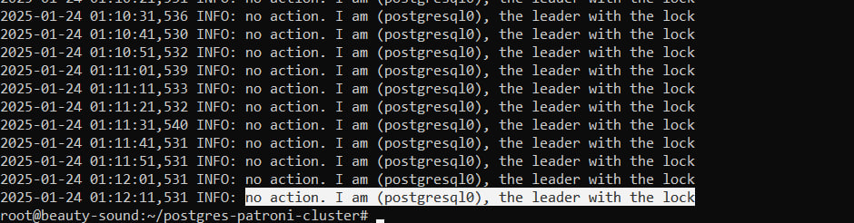
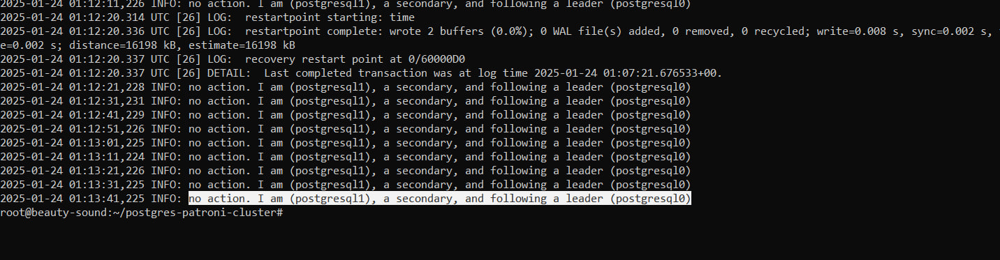
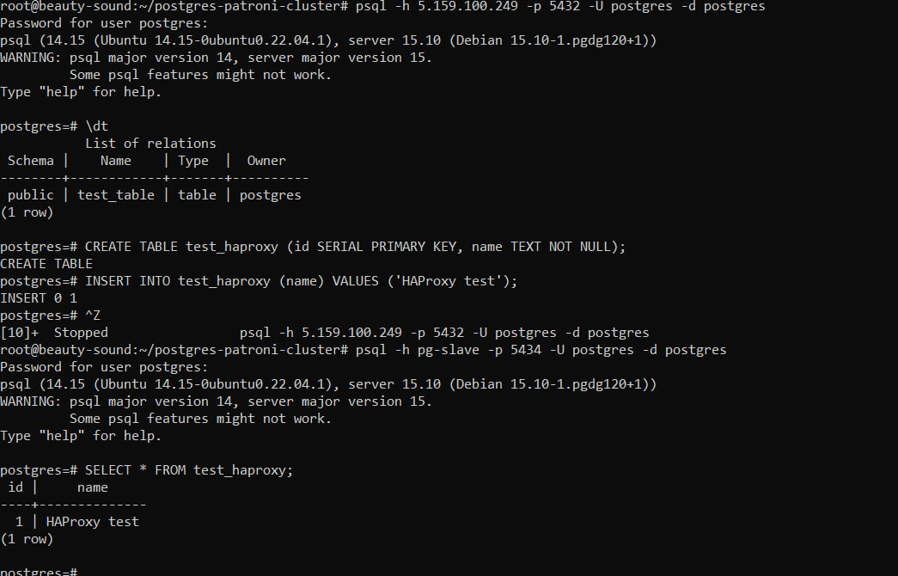

# Задание

Отключение мастера. Проверка работы HAProxy с новым мастером:
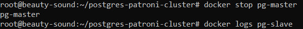
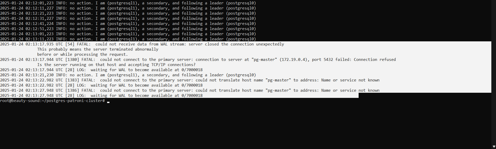
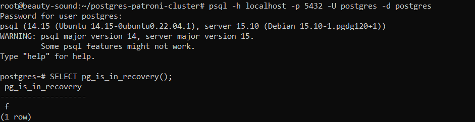

## Ответы на вопросы

**1. Разница между expose и ports:**  

- `Expose` — используется для внутреннего доступа между контейнерами.

- `Ports` — открывает порт для внешнего мира.

**2. Пересборка образов при изменениях:**  

- При обычном перезапуске (`docker-compose up`) образы не пересобираются.
  - Docker использует кэш, и если образ уже был собран, он будет просто запущен снова.
- Изменения в конфигурации (`postgresX.yml`) не влияют на сборку образов.
  - Docker Compose ориентируется на параметры конфигурации контейнеров, а не на пересборку образов. Однако если вы измените параметры, связанные с образом (например, изменить тег образа или изменить путь к Dockerfile), то образ будет пересобран.
- Изменения в `Dockerfile` требуют явного флага `--build` или ручной пересборки.
  - Редактирование содержимого Dockerfile приводит к пересборке образа, потому что Docker будет считать, что содержимое файла изменилось, и будет заново строить образ с учетом новых инструкций в Dockerfile.
